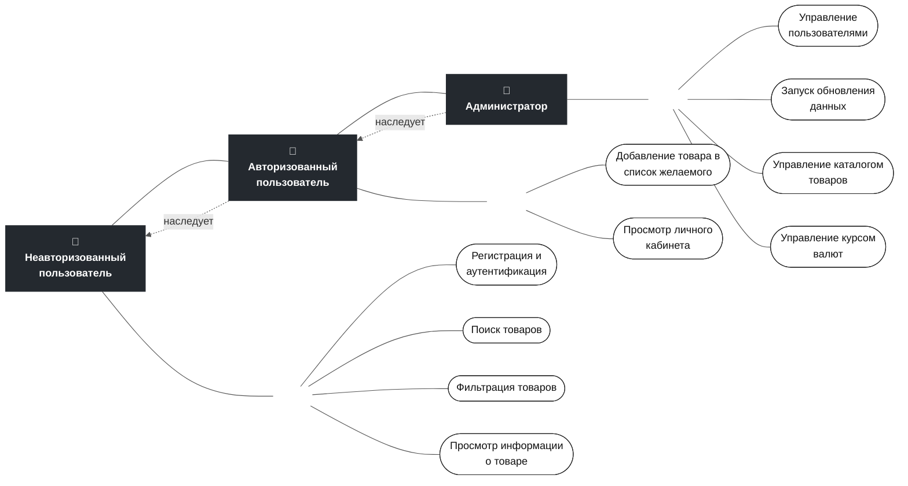
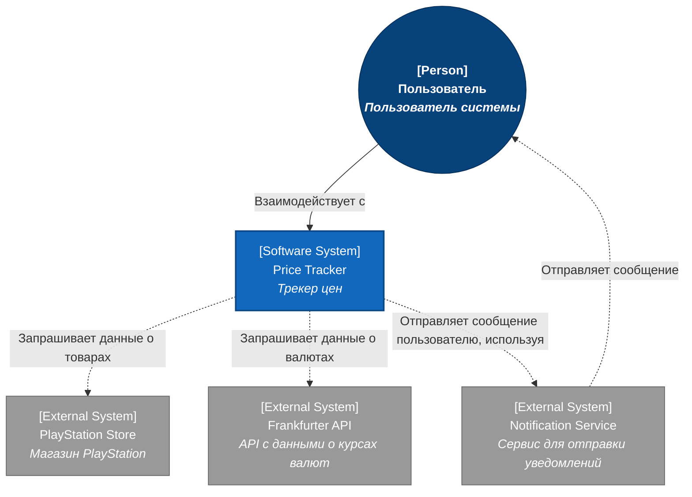
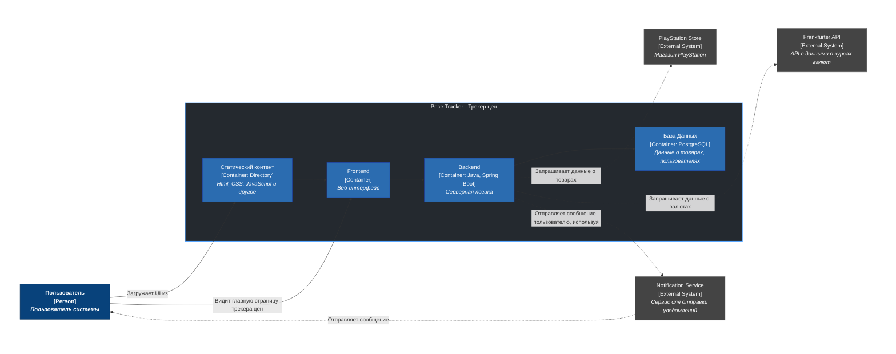

# PlayStation Price Tracker

Веб-приложение для мониторинга и анализа цен в PlayStation Store с функциями списка желаемого и автоматических уведомлений об изменениях стоимости.
## Проблемы и цель

* **Проблемы**

        1. Неудобства для российского пользователя
        2. Неудобная система оповещений
        3. Устаревший дизайн
    
- **Цель**

    Создать удобный и современный трекер цен для пользователя из России


## Стек (In progress)

* **Backend Core:** Java 25, Spring Boot 4
* **Database:** PostgreSQL, Hibernate
* **Libraries & Utilities:** Jsoup, Jackson, Lombok
* **Frontend:** 
* **Infrastructure:** Docker, Git, Maven
## Пользовательские сценарии


## Проектирование данных

```mermaid
## Проектирование данных

```mermaid
erDiagram
    USERS {
        UUID user_id PK
        VARCHAR(255) email
        VARCHAR(255) password
        VARCHAR(255) name
    }

    WISHLIST {
        BIGINT id PK
        TIMESTAMP saving_time
        UUID user_id FK
        VARCHAR(255) product_id FK
    }

    PRODUCTS {
        VARCHAR(255) product_id PK
        VARCHAR(255) name
        VARCHAR(255) invariant_name
        VARCHAR(255) preview_url
        TEXT description
        VARCHAR(255) edition
        VARCHAR(255) release_date
        NUMERIC(3,2) average_rating
        INT ratings_count
        INT store_classification_id FK
        INT publisher_name_id FK
    }

    PUBLISHERS {
        INT id PK
        VARCHAR(255) name
    }

    STORE_CLASSIFICATIONS {
        INT id PK
        VARCHAR(255) type
    }

    BRANDS {
        INT id PK
        VARCHAR(255) brand
    }

    CURRENCIES {
        INT id PK
        VARCHAR(255) currency
        NUMERIC(12,4) exchangeRate
    }

    OFFERS {
        INT id PK
        VARCHAR(255) offer_name
        VARCHAR(255) start_date
        VARCHAR(255) end_date
    }

    GENRES {
        INT id PK
        VARCHAR(255) genre
    }

    LANGUAGES {
        INT id PK
        VARCHAR(255) language
        VARCHAR(255) type
    }

    PLATFORMS {
        INT id PK
        VARCHAR(255) platform
    }

    CURRENT_PRICES {
        BIGINT id PK
        INT original_price
        INT discount_price
        INT branding_id FK
        INT currency_id FK
        INT offer_id FK
        VARCHAR(255) product_id FK
    }

    ALL_PRICES {
        BIGINT id PK
        INT original_price
        INT discount_price
        INT branding_id FK
        INT currency_id FK
        DATE saving_time
        INT offer_id FK
        VARCHAR(255) product_id FK
    }

    PRODUCT_PLATFORMS {
        VARCHAR(255) product_id PK
        INT platform_id PK
    }

    PRODUCT_LANGUAGES {
        VARCHAR(255) product_id PK
        INT language_id PK
    }

    PRODUCT_GENRES {
        VARCHAR(255) product_id PK
        INT genre_id PK
    }

    %% Связи пользователей и списка желаемого
    USERS ||--o{ WISHLIST : "has"
    PRODUCTS ||--o{ WISHLIST : "inWishlist"

    %% Связи справочников с товарами
    PUBLISHERS ||--o{ PRODUCTS : "publishes"
    STORE_CLASSIFICATIONS ||--o{ PRODUCTS : "classifies"

    %% Связи M2M через промежуточные таблицы
    PRODUCTS ||--o{ PRODUCT_PLATFORMS : "has"
    PLATFORMS ||--o{ PRODUCT_PLATFORMS : "includes"

    PRODUCTS ||--o{ PRODUCT_LANGUAGES : "has"
    LANGUAGES ||--o{ PRODUCT_LANGUAGES : "includes"

    PRODUCTS ||--o{ PRODUCT_GENRES : "has"
    GENRES ||--o{ PRODUCT_GENRES : "includes"

    %% Связи текущих цен
    BRANDS ||--o{ CURRENT_PRICES : "offerBrand"
    CURRENCIES ||--o{ CURRENT_PRICES : "priceCurrencyCode"
    OFFERS ||--o{ CURRENT_PRICES : "offer"
    PRODUCTS ||--o{ CURRENT_PRICES : "product"

    %% Связи истории цен
    BRANDS ||--o{ ALL_PRICES : "offerBrand"
    CURRENCIES ||--o{ ALL_PRICES : "priceCurrencyCode"
    OFFERS ||--o{ ALL_PRICES : "offer"
    PRODUCTS ||--o{ ALL_PRICES : "product"
```

Выбранная структура выдержит нагрузку, так как данные, к которым пользователь часто обращается, и данные, которые хранят историческую информацию, разделены по таблицам, поля, по которым будет осуществляться поиск или сортировка проиндексированы, также реализовано сохранение батчами, поэтому база данных не будет нагружена тысячами SQL-запросами. Все это позволяет программе работать с высоким уровнем производительности и без перегрузок.
## Архитектурные схемы

**System context diagram**



Выбранная структура выдержит нагрузку, так как данные, к которым пользователь часто обращается, и данные, которые хранят историческую информацию, разделены по таблицам, поля, по которым будет осуществляться поиск или сортировка проиндексированы, также реализовано сохранение батчами, поэтому база данных не будет нагружена тысячами SQL-запросами. Все это позволяет программе работать с высоким уровнем производительности и без перегрузок.
## Архитектурные схемы

**System context diagram**


**Container diagram**


## Контракты API

| Метод | Эндпоинт | Описание | Задержка сервера |
| :---: | :--- | :--- | :---: |
| **Публичный каталог** | | | |
| `GET` | `/api/v1/homepage` | Получение данных для главной страницы | `< 50 мс` |
| `GET` | `/api/v1/products?query={text}` | Поиск товара | `< 50 мс` |
| `GET` | `/api/v1/products/{id}` | Получение данных конкретного товара | `< 30 мс` |
| `GET` | `/api/v1/products/{id}/history` | Получение истории цен товара | `< 100 мс` |
| **Авторизация и профиль** | | | |
| `POST` | `/api/v1/auth/register` | Регистрация нового пользователя | `< 100 мс` |
| `POST` | `/api/v1/auth/login` | Вход в систему | `< 100 мс` |
| `GET` | `/api/v1/users/me` | Получение профиля текущего пользователя | `< 30 мс` |
| `PATCH` | `/api/v1/users/me/name` | Изменение имени пользователя | `< 50 мс` |
| `PATCH` | `/api/v1/users/me/email` | Изменение почты пользователя | `< 50 мс` |
| `PATCH` | `/api/v1/users/me/password` | Изменение пароля пользователя | `< 100 мс` |
| **Список желаемого (Wishlist)** | | | |
| `GET` | `/api/v1/wishlist` | Получение списка желаемого | `< 50 мс` |
| `POST` | `/api/v1/wishlist/{productId}` | Добавление товара в список желаемого | `< 50 мс` |
| `DELETE` | `/api/v1/wishlist/{productId}` | Удаление товара из списка желаемого | `< 50 мс` |
| **Администрирование каталога и пользователей** | | | |
| `POST` | `/api/v1/admin/products` | Создание нового товара | `< 100 мс` |
| `PATCH` | `/api/v1/admin/products/{id}` | Частичное обновление товара | `< 50 мс` |
| `DELETE` | `/api/v1/admin/products/{id}` | Удаление данных товара | `< 50 мс` |
| `GET` | `/api/v1/admin/users` | Получение списка всех пользователей | `< 50 мс` |
| `GET` | `/api/v1/admin/users/{id}` | Получение информации о пользователе | `< 30 мс` |
| `PATCH` | `/api/v1/admin/users/{id}/status` | Изменение статуса пользователя | `< 50 мс` |
| `DELETE` | `/api/v1/admin/users/{id}` | Удаление пользователя | `< 50 мс` |
| **Мониторинг и фоновые задачи** | | | |
| `GET` | `/api/v1/admin/stats` | Получение статистики | `< 50 мс` |
| `POST` | `/api/v1/admin/jobs/update-prices` | Запуск обновления данных о товарах | `< 100 мс` |
| `POST` | `/api/v1/admin/jobs/update-rates` | Запуск обновления данных о курсах валют | `< 100 мс` |
## Масштаб системы и оценка нагрузки

- Количество пользователей в сутки - 10000
- Рассматриваемый временной промежуток - 14 дней

        1. Количество запросов

        - Среднее количество запросов ~ 8
        - Коэффициент пиковой нагрузки - 10

        **Средний RPS = 0.93**

        **Пиковый RPS = 9.3**

        При 100000 пользователей:

        **Средний RPS = 9.3**

        **Пиковый RPS = 93**

        2. Соотношение read/write нагрузки

        - Количество read запросов (140000 пользователей по 8 запросов) ~ 1130000
        - Количетсов write запросов (Предположим что 5% пользователей изменили свои данные или добавили товар список желаемого, в PS store изменили данные 5000 товаров (так как сохранение происходит батчами по 1000, то это всего 5 write запросов)) ~ 7005

        **Соотношение: 99.4% на чтение к 0.6% на запись**
    
        3.  Объем сетевого трафика

        - Запрос, содержащий данные об одном товаре ~ 2 КБ
        - Запрос, содержащий изменения данных пользователя ~ 0.4 КБ

        ИТОГО ЗА МЕСЯЦ:
        
            Входящий трафик ~ 335 МБ
            Исходящий трафик ~ 71.3 ГБ

        4.  Расчет объемов дисковой системы 

        - Общее количество товаров ~ 30000
        - Вес базы данных, содержащей данные о 1000 товарах 9480 КБ
        - Предположим что каждые 2 недели изменяются цены 5000 товаров
        - Таблица, содерщая данные о ценах 1000 товаров (без истории предыдущих цен) весит 288 КБ
        - На данные пользователей выделим с запасом 1 ГБ

        **ИТОГО: ~1.5 ГБ данных за 5 лет**

Для развертывания моего веб-приложения достаточно минимального VPS (например, Selectel VDS 1-2-25 за 250 рублей в месяц). Данной конфигурации хватит даже для обработки пиковой нагрузки в 93 RPS при 100 000 пользователей. Это обусловлено тем, что 99.4% операций приходится на чтение, а сбор данных со сторонних API выполняется фоново по расписанию и не зависит от активности пользователей. Но если все-таки производительности не хватит, то первым шагом станет вертикальное масштабирование путем улучшения текущего VPS. Затем,  будет внедрен Redis для кэширования частых запросов. И в последнюю очередь, если предыдущих шагов будет недостатачно, будет выполнено горизонтальное масштабирование с запуском второй копии бэкенда за балансировщиком Nginx.
## Отказоустойчивость

* **PlayStation Store**

        - Во время обновления каталога ID продуктов, данные которых не удалось получить в связи с недоступностью PlayStation Store, добавляются в массив listOfErrorId и после завершения основного цикла будет совершено n ретраев (с паузами между ними) для ID из массива. Это позволит решить кратковременные проблемы (например, прерывание сети).

        - В случае полной недоступности будут использоваться последние сохраненные в базе данных данные, а администратору отправляется уведомление о сбое.

* **Frankfurter API**

        - В случае полной недоступности будут использоваться последние сохраненные в базе данных данные, а администратору отправляется уведомление о сбое.

* **Notification Service**

        - В случае недоступности сообщения будут хранится в базе n дней или пока сервис не станет доступным.

        - После восстановления работоспособности сервиса сообщения из базы данных будут отсортированы и отправлены пользователю с датой создания сообщения.